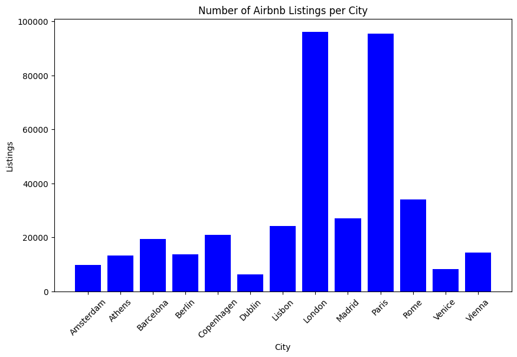
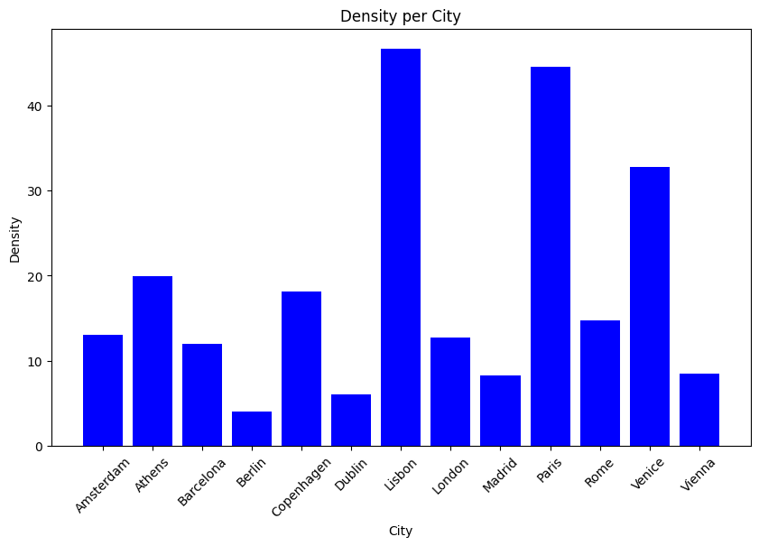
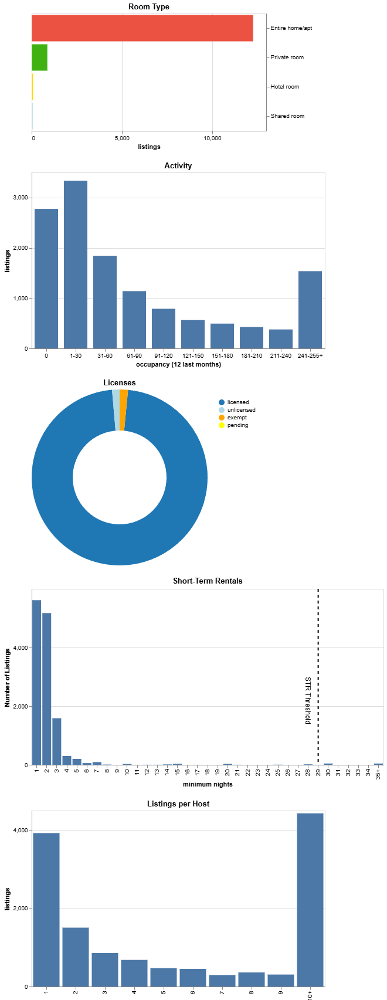

# Exploring AirBnB in Europe

  &nbsp;&nbsp;&nbsp;&nbsp;
  

  
Applied Machine Learning, AUEB 2024  

- [Assignment Specification](assignment.ipynb)
- [Solution Code](airbnb.ipynb)

> Note: GitHub renders notebooks statically and readme includes only images.  
> For full interactivity (widgets, dynamic charts), download `airbnb.ipynb` and open it locally in an environment that supports Jupyter notebooks.  
> Partial interactivity can also be viewed here: [View notebook via nbviewer](https://nbviewer.org/github/odimos/AirBnB/blob/main/airbnb.ipynb)

Data collected by [Inside AirBnB](http://insideairbnb.com).
We use the most recent 12-month period data for the following cities:
Amsterdam, Athens, Barcelona, Berlin, Copenhagen, Dublin, Lisbon, London, Madrid, Paris, Rome, Venice, Vienna.

## AirBnB Listings per city

| City         | Listings |
|--------------|----------|
| Amsterdam    | 9659     |
| Athens       | 13274    |
| Barcelona    | 19482    |
| Berlin       | 13759    |
| Copenhagen   | 20909    |
| Dublin       | 6175     |
| Lisbon       | 24204    |
| London       | 96182    |
| Madrid       | 26980    |
| Paris        | 95461    |
| Rome         | 34061    |
| Venice       | 8322     |
| Vienna       | 14396    |

## AirBnB Densities
Density is the number of AirBnB listings per 1,000 inhabitants, again for the latest 12 months period for which data is available. Number of inhabitants per city are from [World Population Review](https://worldpopulationreview.com/cities/continent/europe).

| City         | Density   |
|--------------|-----------|
| Amsterdam    | 13.023909 |
| Athens       | 19.989579 |
| Barcelona    | 12.014527 |
| Berlin       | 4.015639  |
| Copenhagen   | 18.124764 |
| Dublin       | 6.030114  |
| Lisbon       | 46.743736 |
| London       | 12.727706 |
| Madrid       | 8.286383  |
| Paris        | 44.638169 |
| Rome         | 14.688462 |
| Venice       | 32.761974 |
| Vienna       | 8.510950  |

## Activity
For each city, we estimate activity:
- Assume half of the bookings have reviews
- Assume each booking lasts 3 nights
- Use the number of reviews in the last 12 months per listing
- Estimate booked nights per listing
- Multiply booked nights by listing price to estimate income
- Compute city-level averages

| City        | Average Nights | Average Income |
|-------------|----------------|----------------|
| Amsterdam   | 56.225075      | 16506.873062   |
| Athens      | 86.318819      | 8796.018825    |
| Barcelona   | 71.434863      | 16964.680586   |
| Berlin      | 53.600116      | 11798.788799   |
| Copenhagen  | 30.588550      | 50349.852604   |
| Dublin      | 85.344777      | 15502.200345   |
| Lisbon      | 87.708478      | 13223.195780   |
| London      | 34.545632      | 7016.020093    |
| Madrid      | 84.971831      | 12642.420068   |
| Paris       | 33.640942      | 8281.249416    |
| Rome        | 88.730278      | 17210.262675   |
| Venice      | 117.676280     | 26046.422968   |
| Vienna      | 69.296749      | 9824.910376    |

## Visualisation
> For full interactivity (widgets, dynamic charts), download `airbnb.ipynb` and open it locally in an environment that supports Jupyter notebooks.
> Partial interactivity can also be viewed here: [View notebook via nbviewer](https://nbviewer.org/github/USERNAME/REPO/blob/main/airbnb.ipynb)

### Static example for Athnes

### Top Hosts for Athens

| Host Name                 | Listings | Entire home/apt | Hotel room | Private room | Shared room | City   |
|---------------------------|----------|------------------|------------|--------------|-------------|--------|
| Blueground                | 295      | 295              | 0          | 0            | 0           | Lisbon |
| Feels Like Home           | 293      | 283              | 0          | 10           | 0           | Lisbon |
| Pedro                     | 221      | 9                | 0          | 209          | 3           | Lisbon |
| Ukio                      | 212      | 212              | 0          | 0            | 0           | Lisbon |
| BnBird                    | 161      | 143              | 0          | 18           | 0           | Lisbon |
| Flavio                    | 143      | 29               | 0          | 114          | 0           | Lisbon |
| Luís                      | 129      | 17               | 0          | 112          | 0           | Lisbon |
| Altido                    | 120      | 110              | 0          | 8            | 2           | Lisbon |
| Alexandra Pedro And Team  | 104      | 104              | 0          | 0            | 0           | Lisbon |
| SmithAndAdams             | 68       | 68               | 0          | 0            | 0           | Lisbon |
